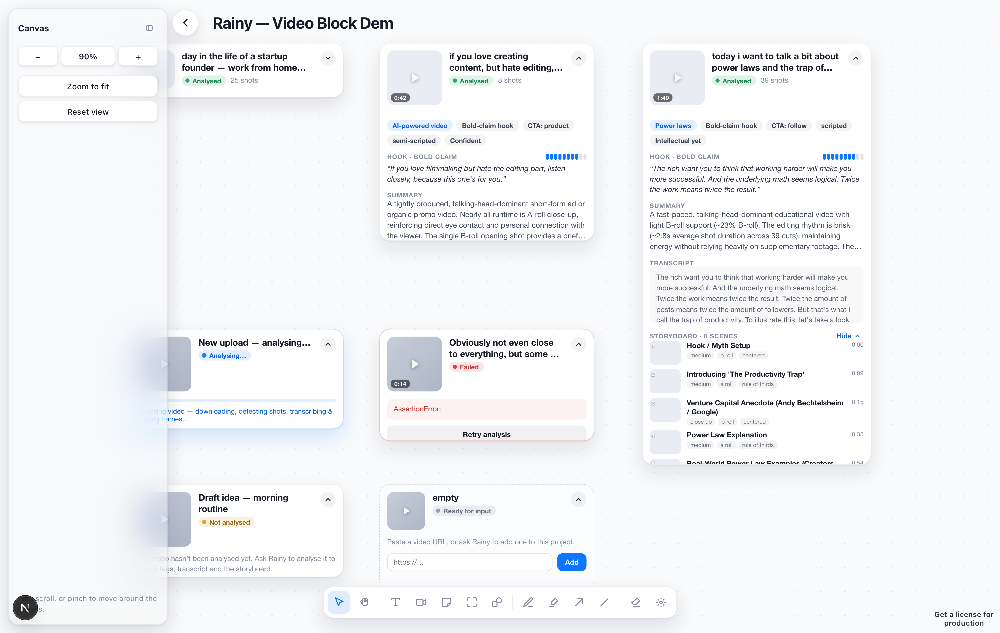
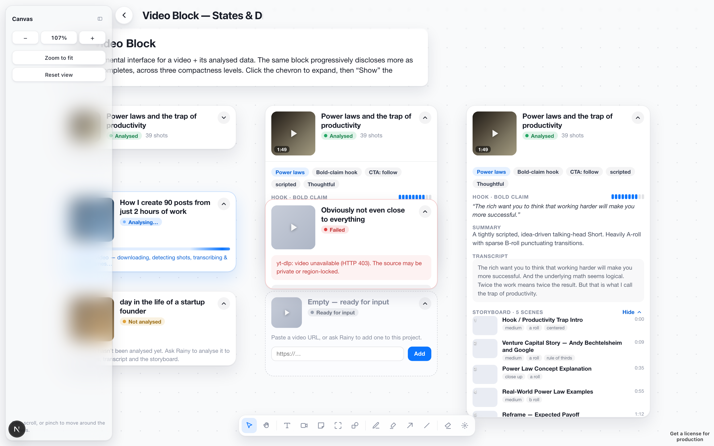

# Running Rainy end-to-end (canvas + MCP + Postgres + Azure)

How to bring up the whole loop locally and drive it from your own Claude client.
Built on the canonical architecture (`docs/architecture.md`): the agent is **your
Claude** over MCP-HTTP; the **python-service** hosts the MCP tools + a read/write
API + a websocket; the **canvas-ui** renders and edits artifacts; **Aiven Postgres**
is the single source of truth; **Azure AI Foundry → Anthropic** does the analysis.

```
 Your Claude ──MCP/HTTP──► python-service ──spawns──► analysis-worker ──► Azure(Claude)
   (.mcp.json)              :9000  │  ▲ pg LISTEN/NOTIFY        │ writes
                         /api r/w  │  └───────── ws change-signal ─────┐ │
                            /ws    ▼                                   ▼ ▼
                        canvas-ui  ◄──► reads/writes /api, ws ──────  Aiven Postgres
                        :3000 (Next.js + tldraw, static-export-ready)
```

## 0. Prerequisites
- Python 3.11+ and Node 20+.
- **`ffmpeg`** on `PATH` (the analysis-worker shells out to `ffmpeg`/`ffprobe` for
  frame + audio extraction): `brew install ffmpeg`.
- Credentials in **`src/python-service/.env`** (gitignored):
  ```
  # Required
  DB_CONNECTION_STRING=postgres://…aivencloud.com:20891/defaultdb?sslmode=require

  # Claude vision — video analysis (Azure AI Foundry) or direct Anthropic key
  AZURE_ANTHROPIC_URL=https://<resource>.services.ai.azure.com/anthropic
  AZURE_ANTHROPIC_KEY=…
  # ANTHROPIC_API_KEY=…   # alternative: direct Anthropic key

  # Image generation — creator room + storyboard frames (Azure OpenAI)
  AZURE_OPENAI_URL=https://<resource>.openai.azure.com
  AZURE_OPENAI_KEY=…

  # Optional: voice features
  # ELEVENLABS_API_KEY=…
  ```
  `config.py` auto-loads this file, so no manual exports are needed.

## 0a. Provision the Aiven Postgres database (first-time setup)

If you don't have an Aiven Postgres service yet, you can create one through the
**Aiven MCP server** directly from Claude Code.

**1. Add the Aiven MCP server to Claude Code (hosted, recommended):**
```bash
claude mcp add --transport http aiven "https://mcp.aiven.live/mcp"
```
Start Claude Code, approve the server connection, and authenticate via browser when
prompted. Confirm it's working: *"List my Aiven projects."*

> Alternatively, use a local install with your Aiven API token:
> ```bash
> claude mcp add --scope user aiven-mcp -e AIVEN_TOKEN=<your-token> -- npx -y mcp-aiven
> ```

**2. Ask Claude to create the service:**
```
Create a Postgres database service called "rainy" in my Aiven project,
in the AWS eu-west-1 region (or nearest to me), using the smallest plan.
Then show me the connection string including the password.
```
Claude will use the Aiven MCP tools to provision the service and retrieve the
connection string (URI form: `postgres://avnadmin:<pw>@<host>:20891/defaultdb?sslmode=require`).

**3. Apply the schema:**
Once you have `DB_CONNECTION_STRING`, create `src/python-service/.env` and run:
```bash
cd src/database
../python-service/.venv/bin/python apply_schema.py
```
This creates all tables and indexes. To reset a database to a clean state:
```bash
../python-service/.venv/bin/python apply_schema.py --reset
```

> The Aiven MCP server's "Allow connection credentials" setting must be enabled in
> your Aiven Console (Admin → MCP settings) for Claude to read the password back.

## 1. python-service (MCP + read/write API + websocket)
```bash
cd src/python-service
python -m venv .venv
./.venv/bin/pip install -r requirements.txt
# The analysis-worker is spawned with the service's interpreter (sys.executable),
# so its deps must live in THIS venv too — install them here, not in a separate env:
./.venv/bin/pip install -r ../analysis-worker/requirements.txt
# Start with the venv bin (yt-dlp) + ffmpeg on PATH so the spawned worker finds them:
PATH="$PWD/.venv/bin:$(brew --prefix)/bin:$PATH" ./.venv/bin/python server.py   # → :9000
```
Smoke test: `curl http://127.0.0.1:9000/api/health` → `{"ok":true,"db":true}`.

Optional worker deps degrade gracefully if missing: **`crispasr`** (speech-to-text —
skipped, analysis continues with no transcript) and **`mediapipe`/`easyocr`** (face/OCR
metrics — OpenCV Haar-cascade fallback for faces, OCR skipped). The vision + video-level
LLM analysis (the storyboard, hook, tags) does **not** depend on any of these.

Each worker run streams its full stdout/stderr to `src/python-service/worker-logs/<video_id>.log`
— tail that to debug a download/analysis failure (the short reason is also stored in
`videos.analysis_error` and surfaced by `/api/videos/{id}/status`).

If the database is fresh or you need to reset it, see **section 0a** above.

## 2. canvas-ui (the infinite canvas)
```bash
cd src/canvas-ui
echo 'NEXT_PUBLIC_RAINY_API_URL=http://localhost:9000' > .env.local   # gitignored
npm install
npm run dev                              # → http://localhost:3000
```
With the API URL set, the Home grid lists Postgres-backed projects and the canvas
reads artifacts from `/api`, subscribing to `/ws` for live updates. **Unset it**
and the canvas runs fully offline on the bundled XML seeds (including the
`Video Block — States & Disclosure` showcase).

## 3. Connect your Claude (MCP)
`.mcp.json` (repo root) already registers the server:
```json
{ "mcpServers": { "local-python-service": { "type": "http", "url": "http://127.0.0.1:9000/mcp" } } }
```
Start Claude Code in this repo (with the python-service running) and approve the
server. You then have 16 tools (`mcp__local-python-service__*`): `create_project`,
`create_artifact`, `analyze_video`, `analyze_channel`, `get_video_analysis`,
`save_memory`, … Try:

> "Create a project called *My Channel*, then add a video block for
> https://youtu.be/… and analyse it."

The agent calls `create_project` → `create_artifact` (a `type:'frame'` artifact
with a video element) → `analyze_video`. The canvas shows the block flip
**empty → analysing → analysed** in real time as the worker writes results and
NOTIFYs the canvas.

## 4. Seed the demo (optional)
```bash
cd src/database
../python-service/.venv/bin/python seed_demo.py
```
Drives the MCP tools over HTTP to create a **"Rainy — Video Block Demo"** project
whose blocks reference real analysed/analysing/failed videos already in Aiven.
Open the printed `#/p/<id>` in the canvas.

## The Video Block
The fundamental video interface. It renders the analysis lifecycle and
progressively discloses fields by stage, across three compactness levels you
toggle with the chevron + storyboard control:

| Stage (`*`) | Disclosed | Source |
|---|---|---|
| `*`  not analysed → | title, thumbnail, tags | `videos.title`, palette gradient, derived from `metrics.llm` |
| `**` analysed →     | transcript, description | `metrics.transcript.text`, `metrics.llm.overall_style_summary` |
| `***` analysed →    | storyboard scenes | `metrics.llm.segments[]` joined to `shots[]` |

States: **empty · not_analysed · analysing · analysed · error**.

**Two ways to analyse a video:**
1. **From the canvas** — drop a Video block (bottom dock), paste a URL in the block
   (or the sidebar inspector) and hit **Analyse** (also **Retry** on a failed block).
   The block POSTs `/api/analyze`, flips to **analysing**, then polls `/api/videos/{id}`
   until the result lands — no agent required.
2. **From your Claude (MCP)** — the agent calls `analyze_video` (and `create_artifact`
   for a persisted block); the websocket re-pull renders progress on the canvas.




## How it fits together
- **Video blocks are artifacts** of `type:'video'` (seed/demo legacy path) or
  `type:'frame'` elements of kind `video` (agent-created). In both cases
  `payload.video_id` points at a `videos` row; the read API joins the live analysis
  (`video_view.derive_video`) at request time. Placeholder blocks (empty /
  not_analysed) carry their `state` in the payload instead of a `video_id`.
- **Realtime** is a websocket change-signal only — never data. `analyze_video` and
  the analysis-worker emit a Postgres `NOTIFY rainy_change`; the service forwards it
  to the right project's subscribers; the canvas re-pulls and reconciles. A
  visibility-aware 6s poll covers any missed signal.
- **No DDL** was added to the shared DB — only `pg_notify` (a function call).
