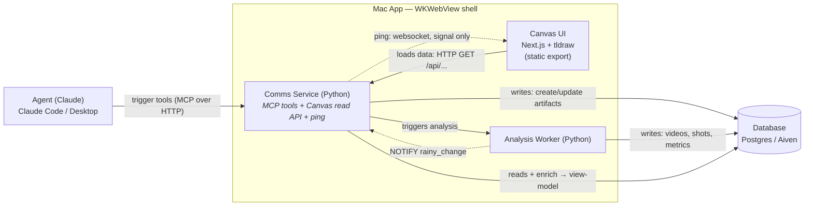
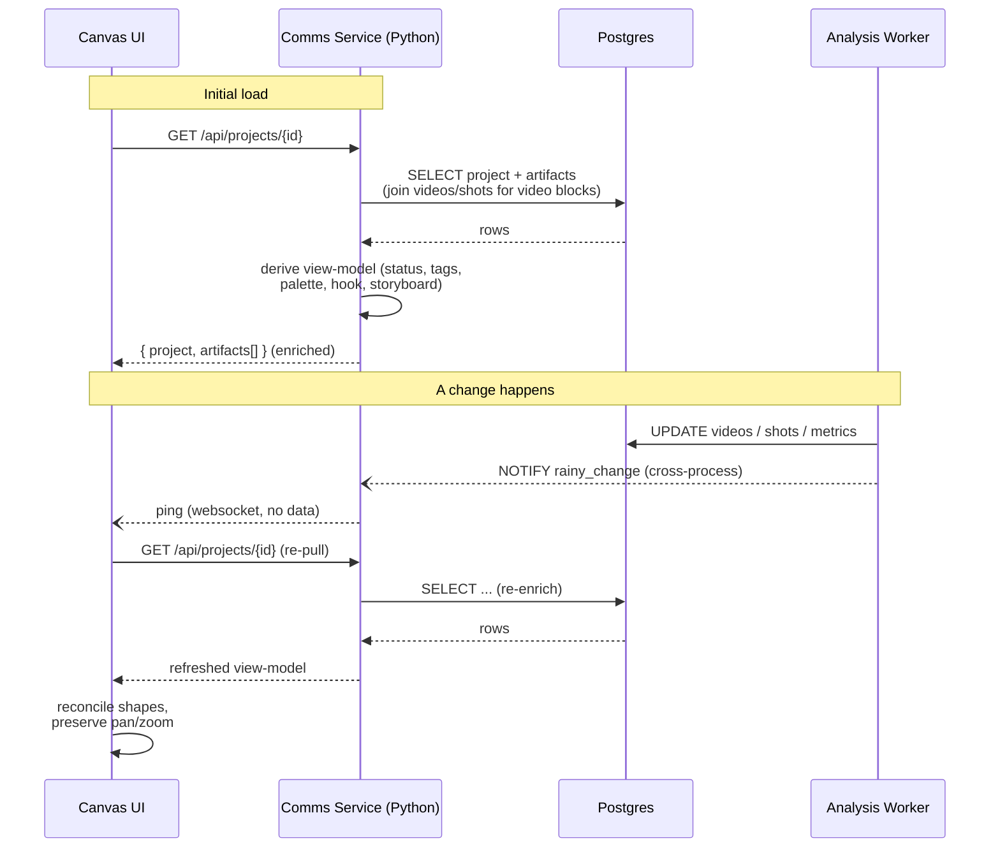

# Communication Architecture

_Updated 2026-06-25. Companion to `docs/architecture.md`._

**Decision:** the Canvas UI reads its data through the **Comms Service (Python) HTTP read API** —
**not** by connecting to Postgres directly. A WKWebView is a browser: it cannot hold a Postgres
socket, and DB credentials cannot ship in a static bundle. Since the Comms Service must exist anyway
(MCP tools + ping + analysis trigger) and already owns a Postgres pool + the Aiven CA, the read
endpoints are marginal-cost-zero there. See `docs/DECISIONS.md` for the full rationale.

> This corrects the whiteboard sketch: the **"loads data"** arrow does **not** go
> `Canvas UI → Postgres`. It goes `Canvas UI → Comms Service → Postgres`.

## Topology



**Legend:** solid arrows = data/requests. Dashed arrows = **signals only, no payload**
(the ping tells the canvas *"something changed, re-pull"* — it never carries data).

## The realtime read loop (ping → re-pull)

The websocket carries a change-signal only. On any signal, the canvas re-pulls the full project
state over HTTP and reconciles it against the canvas (preserving the user's pan/zoom).



## Responsibilities

| Component | Owns |
| --- | --- |
| **Agent (Claude)** | Drives everything by calling MCP tools over HTTP. The user's own Claude client. |
| **Comms Service (Python)** | MCP tool surface (writes), the Canvas **read API** (`/api/projects`, `/api/artifacts`, `/api/videos`, `/frames`), the **view-model derivation** (raw DB rows → UI-ready shapes), the **ping** (websocket + `LISTEN/NOTIFY` routing), and triggering the worker. |
| **Analysis Worker (Python)** | Heavy video/channel analysis. Writes `videos`/`shots`/`metrics` to Postgres and emits `NOTIFY rainy_change` so the canvas refreshes. |
| **Canvas UI (Next.js + tldraw)** | Static export in the WebView. Reads the view-model over HTTP, renders artifacts as tldraw shapes, re-pulls on ping. Holds **no** DB connection and **no** credentials. |
| **Database (Postgres / Aiven)** | Single source of truth. `projects`, `artifacts`, `videos`, `shots`, `memory`. |

## Block model (MVP) — frames as flows

The canvas is a pure projection of `artifacts`. **Every artifact is a `frame` (a
flow); the blocks it contains live inside `payload.elements`.** No schema change —
this is the composite model the schema was built for (element ids inside the
payload, addressable via `update_artifact(id, element_id, element_patch)`).

A `frame` artifact:

```jsonc
{
  "type": "frame",
  "title": "Ideation",
  "position": { "x": 80, "y": 80, "w": 760, "h": 560 },   // the frame box
  "payload": {
    "label": "Ideation",
    "role": "ideation",                                    // optional
    "elements": [
      { "id": "el-1", "type": "text",  "content": "<p>Hook idea…</p>", "x": 32, "y": 64, "w": 320, "h": 200 },
      { "id": "el-2", "type": "video", "video_id": "…", "view": "compact", "x": 400, "y": 64 }
    ]
  }
}
```

- **A flow = one frame artifact.** Its blocks are the elements; element `x/y` are
  **relative to the frame**. The renderer expands the artifact into a tldraw frame
  plus one child shape per element (created frame-first so the parent exists).
- **Video elements are enriched** server-side: the read API joins the `videos`
  table by `element.video_id` and attaches the `VideoData` view-model onto the
  element (`_enrich_artifact` → `_video_view`).
- **Addressing one block:** `update_artifact(frame_id, element_id="el-1",
  element_patch={...})` merges into that element only; `version` bumps → ping →
  re-pull.

**Phase 1 (current): agent-only, read-only canvas.** The agent authors everything
via MCP; the canvas only renders. Deferred to phase 2: the canvas → DB write path
(manual edits) and an `author` marker (user vs. agent).

## Contract direction

The **read contract is defined by what the Canvas UI needs to render** (the view-model), not by the
DB layout. The DB schema (`src/database/schema.sql`) is already fixed; the view-model is the adapter
the Comms Service derives from it (`src/python-service/video_view.py`). The view-model shape is the
**single source of truth** for the contract — TS types on the canvas side should be generated from /
kept in lockstep with it, not hand-redeclared, to avoid drift.
