# Rainey for Agencies — UGC Coaching: Flow & Surface Exploration

> Working doc to map the flows, audit the value of every step, and explore what the
> product surface should actually be (canvas vs MCP vs upload/download vs table vs beyond).
> Built to paste into Notion. Every diagram is Mermaid. Mark it up and feed back.

---

## 0. The one-paragraph thesis (read this first)

The thing that got validated on the call and on the `/agencies` page is **not a canvas**. It's a
narrow, painful, recurring job: *"coach the part of the video no one can see — at scale — without
watching every video myself."* That job is an **operational pipeline** (a queue of deliveries, each
producing a Slack-ready note, with scores trending over time), not a thinking surface. The infinite
canvas we built is a *thinking* surface — it was the right tool for the **solo-creator ideation**
product, and it's the wrong default for **agency coaching**.

So the reframe I want to argue for:

> **The moat is the analysis + comparison + note generation. The surface is a thin, swappable
> client.** Build the core once (frame-level signals → diff against brief/reference → coaching note +
> score). Then front it with whatever surface the customer actually lives in. Don't marry the canvas.

Everything below maps the loop, audits each step's *real* value (by asking "what breaks if we delete
it?"), then lays out the surface options with diagrams so we can pick deliberately.

---

## 1. Who is this for, really? (actors & jobs)

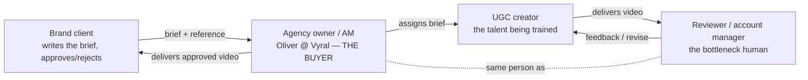

| Actor | Job-to-be-done | Pays? | Pain today |
|---|---|---|---|
| **Agency owner (Oliver)** | Scale roster without scaling reviewer headcount; prove quality to clients | **Yes — the buyer** | Feedback doesn't scale; quality is inconsistent; can't show improvement |
| **Reviewer / AM** | Give fast, concrete feedback on *execution*, not just transcript | (their time is the cost) | Execution (tone, hook, expression) is invisible to current AI tools |
| **UGC creator** | Get approved on fewer takes; get paid; improve | No (but is the thing being "trained") | Feedback is vague, subjective, slow, transcript-level |
| **Brand client** | Get on-brief videos | (upstream payer) | Doesn't see Rainey directly — but is the quality bar |

**Key point for feedback:** the validated pitch is **agency-facing** (Oliver buys). But the verb is
*"train your creators to be better."* That implies a **second, creator-facing surface** eventually —
the creator has to *receive and act on* coaching, and ideally *self-check before submitting*. The
two-sided loop is where the real "training" moat lives. Decision: do we build one-sided (agency note
generator) first, or design for two-sided from the start? (See §8.)

---

## 2. The validated value prop, distilled

From `rainey.lovable.app/agencies` + the Oliver call:

- **Headline:** *"Coach the part of the video no one can see."*
- **Core promise:** frame-level coaching at scale — beyond transcripts.
- **3 steps as pitched:** Connect → Analyze → Coach.
- **Dimensions sold:** visual hook strength · tone match to reference · expression/energy ·
  reference adherence.
- **The deliverable:** *Slack-ready* coaching notes.
- **The retention hook:** *improvement graphs* — "see each creator's hook, tone, reference scores
  climb, or stall, over time."
- **Oliver's words:** "a whole business in itself" *if visual analysis is solved*.
- **Pricing reality:** $199 pilot → $199–500/mo. **Up to 50 videos/month.** Compute = a few $/video
  (vs ~$0.30 transcript-only). 30-day money-back. Founder access.

**Two things the pricing tells us about the surface:**
1. **50 videos/month** is a *queue*, not a *whiteboard*. The primary surface needs to make a stream
   of deliveries scannable and triageable.
2. **A few $/video** means analysis is metered and gated. The surface must respect "you have N
   analyses left" — that's a usage/credits UI concern, not a canvas concern.

---

## 3. The core loop (current mental model)

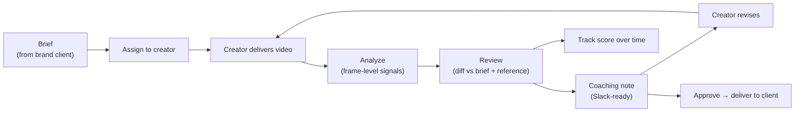

This is the loop the codebase already encodes (`UGC_REVIEW_GUIDE`, `compare_components`,
`docs/ugc-review-loop.md`): **Brief → Deliver → Review → Coach.** The question this doc asks is *not*
"is the loop right" (it is) — it's **"what is each step really worth, and what's the thinnest surface
that delivers it?"**

---

## 4. The value audit — the *real* value of every step

For each step I ask the lean question: **what actually breaks if we delete this step?** That exposes
which steps are load-bearing (build them well) vs. ceremony (cut or fake them in v1).

| Step | Job it does | Who cares | Value if kept | What breaks if we CUT it | Thinnest viable form |
|---|---|---|---|---|---|
| **1. Brief intake** | Gives the comparison a ground truth | Agency | Enables "did they follow the brief" | Reviewer has no objective bar; falls back to vibes | **Paste brief text** (or compare to a *reference video* instead — see insight below) |
| **2. Roster / creator identity** | Anchors history per creator | Agency | Makes improvement-over-time possible | No trends, no "coaching layer," loses the retention hook | A table of creators with an id + history |
| **3. Delivery ingestion** | Gets the actual pixels in | Agency + creator | The whole thing is impossible without the video | Product can't run at all | **Upload / Drive / Slack drop** (NOT url-scrape — that's the blocker, D42) |
| **4. Frame-level analysis** | Extracts hook/tone/pacing/OCR/expression | (invisible infra) | **THE MOAT** — what transcript tools can't do | You're just another transcript tool; no reason to pay | Keep — but it's backend, never a UI |
| **5. Review / diff** | Compares delivery vs brief+reference per dimension | Reviewer | Turns raw signals into "here's the gap" | Raw metrics are unreadable; reviewer still does the work | Agent reasoning (already built, D40) |
| **6. Coaching note** | The thing the creator actually reads | Creator (via agency) | **THE DELIVERABLE** — Slack-ready, copy-paste | Nothing to send; product produces no output | A text blob → Slack/email |
| **7. Improvement-over-time** | Shows the line going up | Agency + client + creator | **THE RETENTION HOOK** + the upsell to clients | Becomes a one-shot tool, not a platform; churns | A scores table → sparkline/chart |
| **8. Pattern/niche insight** | "What's working in this niche" (LightReel-style) | Agency (later) | Differentiation, expansion | Lose an *expansion* story, not the core | Defer — separate product surface |

### Three insights that fall out of the audit

1. **Brief-as-text may be optional in v1.** The *validated* dimension is **reference adherence**, and
   a reference is a *video* that analyzes with the exact same pipeline as the delivery. So the leanest
   comparison is **delivery video vs reference video** → diff + note. The text brief is a *constraint
   layer* on top (the on-screen-text / Notes checks), not the foundation. This collapses step 1 into
   "drop a reference video" for the MVP. (The code already supports video-vs-video via
   `compare_components`.)

2. **Steps 3, 6, 7 are the load-bearing ones — and none of them is a canvas.** Ingestion (get the
   file in), note (get the text out), trend (show the line). Those three define the product. Analysis
   (4) is invisible infra. Review (5) is agent reasoning. **The canvas touches none of the
   load-bearing steps.**

3. **The "training" promise lives in step 7 + the loop closing.** A single note is a *transaction*.
   "Training your creators" only becomes real when the creator sees their own scores move and adjusts.
   That's the difference between a tool and the "whole business" Oliver described.

---

## 5. What's actually built today (grounding)

So we don't design in a vacuum — here's the real machine (`src/python-service`, `src/analysis-worker`,
`src/canvas-ui`):

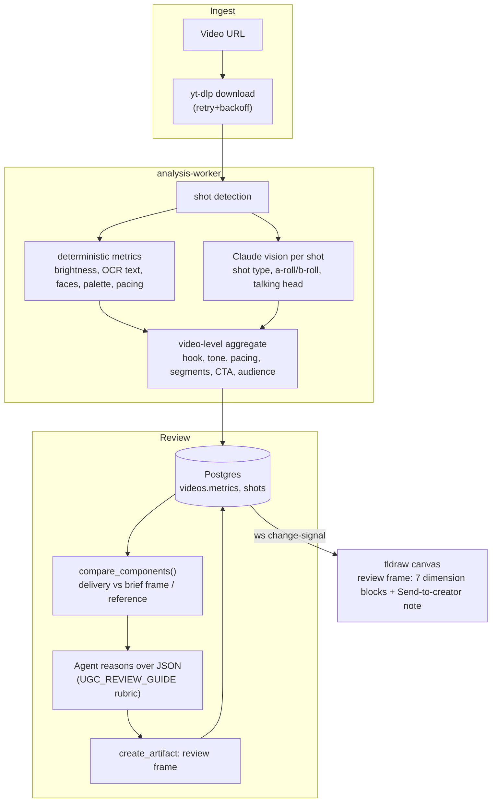

**Signals we already extract** (this is the asset — the moat is real and mostly done):
hook text/format/**strength**/opening-words · tone adjectives/voice/**speaking-style**/scriptedness ·
pacing cut-frequency/avg-shot-len/**fast-cut-ratio**/pacing-curve · segment structure (beats) ·
on-screen-text **OCR** · CTA presence/type/placement · talking-head ratio · words-per-minute ·
speech/silence ratio · face area · dominant palette.

**Built ✅:** analysis pipeline, `compare_components`, review rubric, review frame on canvas,
coaching note block, agent (Claude Code *and* embedded Agent SDK both speak the loop).
**Not built / aspirational:** CSV brief import UI, creator history, **improvement-over-time**, Slack
delivery, upload ingestion, scoring/trend storage.
**The known blocker (D42):** IG/TikTok url-ingestion via yt-dlp (needs cookies/login). Agencies
*already keep footage in Drive* → upload/Drive ingestion sidesteps this entirely.

> **Read this against §4:** what's built well is the moat (analysis) + the reasoning (review). What's
> *missing* is exactly the load-bearing operational stuff (ingestion that works, Slack out, trends).
> And the one big thing we *did* build a surface for — the canvas review frame — is on the
> **least** load-bearing step.

---

## 6. THE BIG QUESTION — what is the surface?

This is the core of the exploration the user asked for. Six candidate surfaces, each with its flow,
when it wins, and what it costs. I'm opinionated at the end.

### 6.0 A frame for choosing

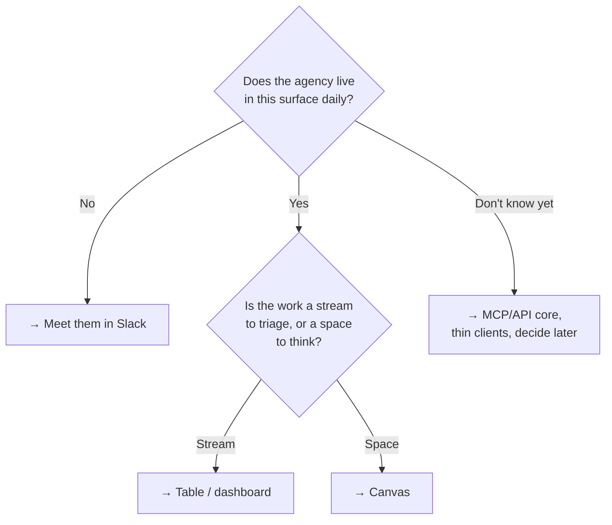

### 6.A — Infinite canvas (what we have)

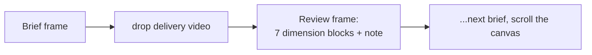

- **Wins when:** the work is *exploratory/visual* — brief authoring, storyboard, rich side-by-side
  diff, one-off deep dives. Great for the **solo-creator ideation** product.
- **Loses when:** you have 50 deliveries/month across 12 creators. A canvas has no queue, no triage,
  no sort-by-worst, no trend column. Spatial layout becomes *overhead* for repetitive review.
- **Cost:** already built. **Honest take:** keep it as an *optional deep-dive* surface, not the home.

### 6.B — MCP-only / agent-native (no GUI we build)

The agency's own Claude/Slack agent calls our MCP tools; output goes straight to where they work.

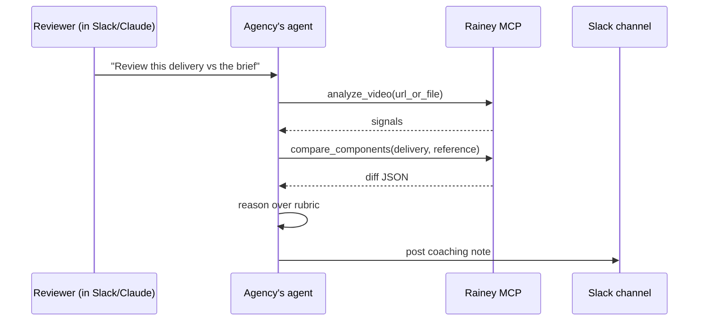

- **Wins when:** the buyer already has an agent; we want **zero UI to build** and to dogfood the
  "agent is the user's own client" architecture. Lowest possible build cost. Meets them in Slack.
- **Loses when:** no persistent roster/trend (steps 2 & 7 vanish), nothing to show the brand client,
  and it assumes every agency runs an agent (most don't, yet).
- **Cost:** nearly free (mostly built). **Honest take:** great *power-user* and *demo* surface; can't
  carry the retention hook alone.

### 6.C — Simple upload → download micro-app

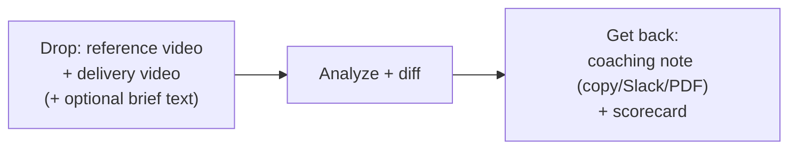

- **Wins when:** you want the **simplest possible sell** — "paste the brief, drop the video, get the
  note." No learning curve. Solves ingestion head-on (it's an upload). Perfect for the pilot/demo.
- **Loses when:** stateless — improvement-over-time needs accounts + roster bolted on. Not yet a
  "platform," easy to churn after the novelty.
- **Cost:** low-medium (a thin web form over the existing pipeline). **Honest take:** strongest
  *first* surface to validate willingness-to-pay and de-risk ingestion.

### 6.D — Table / roster dashboard

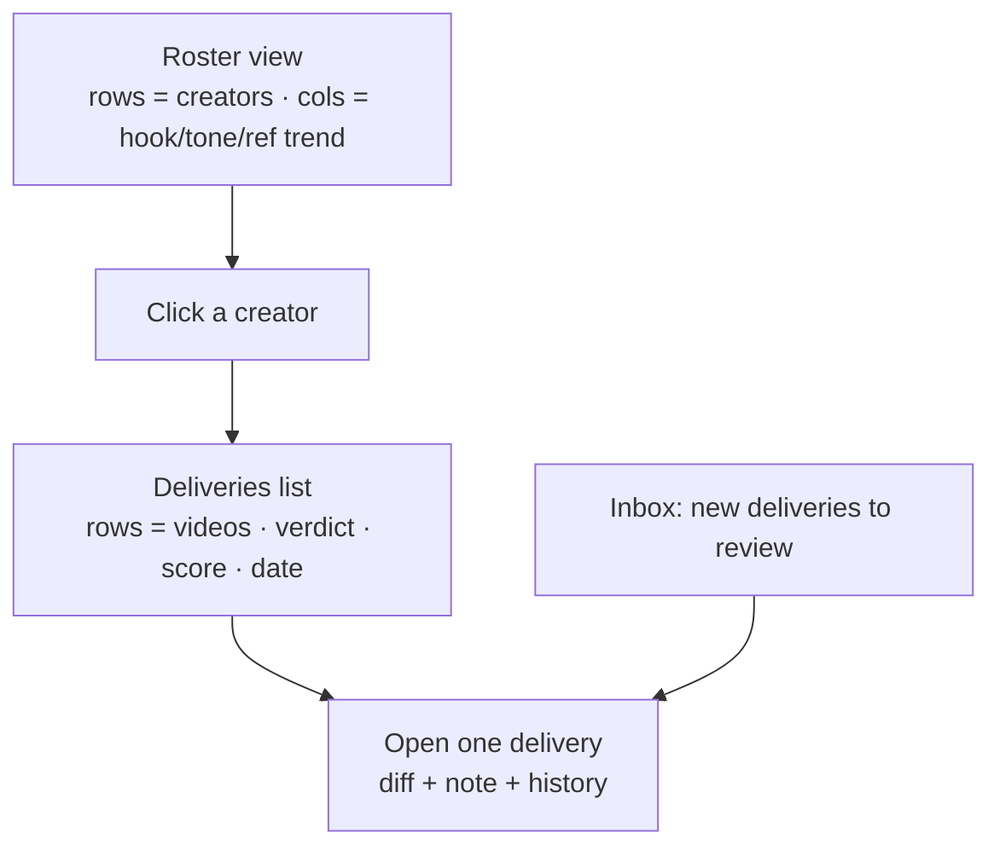

- **Wins when:** you have many creators × many videos. This is **how agencies already work** (Google
  Sheets feedback tracker, per the call). Natural home for the **improvement graph** (step 7). Scales,
  scannable, sortable, triageable.
- **Loses when:** less "wow" in a demo; the rich visual diff is cramped in a row.
- **Cost:** medium build. **Honest take:** the right *primary* surface for the validated buyer once
  past the pilot. The improvement graph has nowhere else natural to live.

### 6.E — Slack-native app/bot

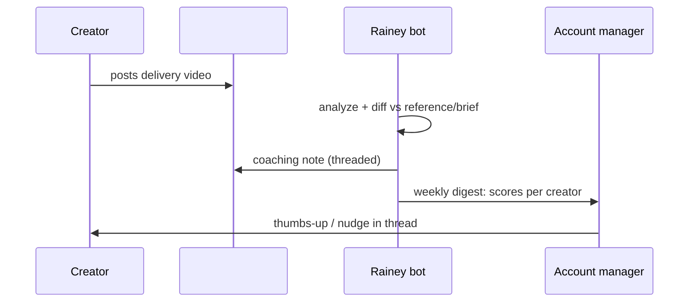

- **Wins when:** the delivery workflow *already happens in Slack* (Oliver explicitly wanted a
  Slack-based feedback workflow). Zero context switch; viral inside the agency.
- **Loses when:** Slack's UI can't host rich trends (needs a companion dashboard link); Slack app
  review + per-workspace install friction.
- **Cost:** medium. **Honest take:** the *delivery* channel for the note (step 6), pairs with D for
  trends. This is probably where the note should *land*, regardless of where it's *generated*.

### 6.F — White-label creator-facing portal (the "training" surface)

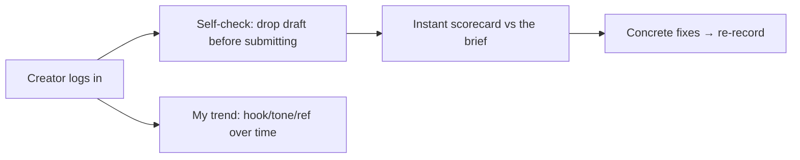

- **Wins when:** you want to actually *train* creators (the literal value prop) and create a
  two-sided moat: creators self-improve → agency does less review → creators get approved faster.
- **Loses when:** it's a bigger build and a second audience; premature before the agency side proves
  out.
- **Cost:** high. **Honest take:** the *expansion* surface and the real long-term moat — but Phase 3,
  not now.

### Surface comparison (the table to argue over)

| Surface | Build cost | Solves ingestion? | Holds trends (step 7)? | Where they live? | Demo wow | Role |
|---|---|---|---|---|---|---|
| **A. Canvas** | Built | No | No | No (we made them come) | High | Optional deep-dive |
| **B. MCP-only** | ~Free | Partial | No | Yes (Slack/agent) | Med | Power-user + demo |
| **C. Upload→download** | Low-Med | **Yes** | No (add accounts) | Sorta | Med-High | **Pilot wedge** |
| **D. Table/dashboard** | Med | Neutral | **Yes** | Yes (Sheets-like) | Med | **Primary at scale** |
| **E. Slack bot** | Med | Partial | No (link out) | **Yes (native)** | Med | **Note delivery** |
| **F. Creator portal** | High | Neutral | Yes (per-creator) | New audience | High | Phase-3 moat |

---

## 7. Recommendation — decouple the core from the surface

The surfaces above aren't mutually exclusive, and picking one "forever" is the trap. The clean move:

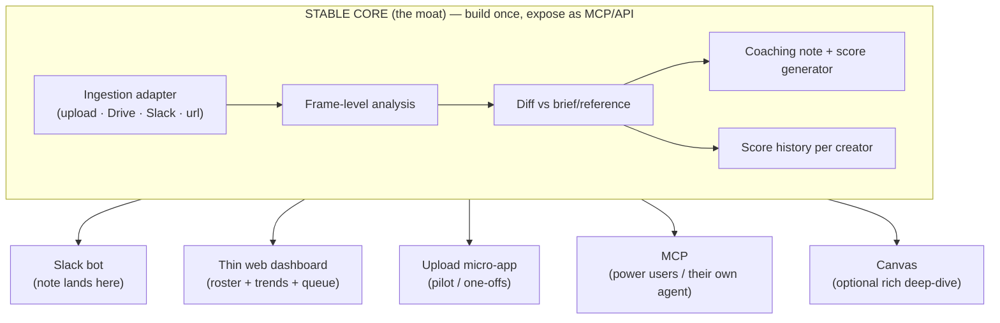

**Why this resolves the canvas-vs-table-vs-MCP tension:** you don't have to choose. The expensive,
defensible part (analysis → diff → note → score) becomes a **headless core** exposed as MCP + a thin
HTTP API. Every surface is then a **thin, swappable client** — and the canvas becomes *one optional
client*, not the foundation we retrofit everything into.

### Suggested phasing

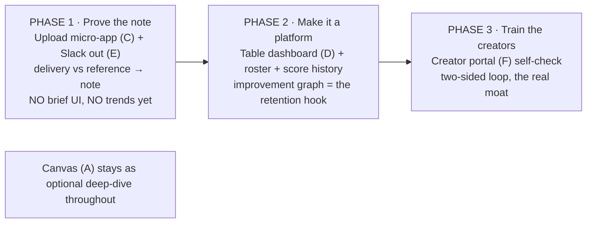

- **Phase 1 kills the two biggest risks at once:** ingestion (upload sidesteps yt-dlp/D42) and
  "is the note good enough to send" (the actual product). Smallest thing Oliver can pay $199 for.
- **Phase 2 adds the thing he'll *renew* for:** the line going up.
- **Phase 3 is the "whole business":** creators self-coach; agency review load drops.

---

## 8. The two-sided loop (why "training" needs the creator)

A single note is a transaction. *Training* is a loop that closes on the creator. Mapping it makes the
Phase-3 bet concrete:

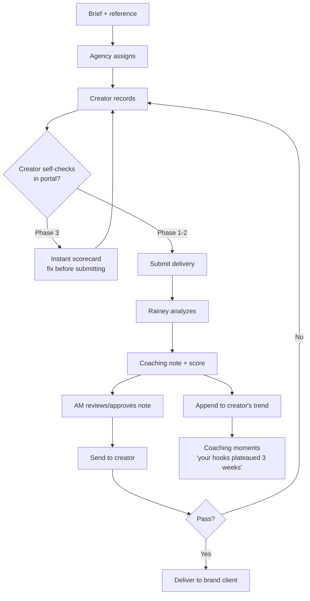

**The compounding value:** self-check (Phase 3) moves the analysis *upstream of submission* → fewer
revision cycles → less AM time → creators improve faster → trend line is the proof you show the brand
client to keep the account. That's the flywheel that makes it "a whole business," not a feature.

---

## 9. Ingestion — the real blocker, made explicit

Ingestion is load-bearing (step 3) *and* the known failure (D42: IG/TikTok yt-dlp needs login). The
surface choice and the ingestion choice are linked, so make it deliberate:

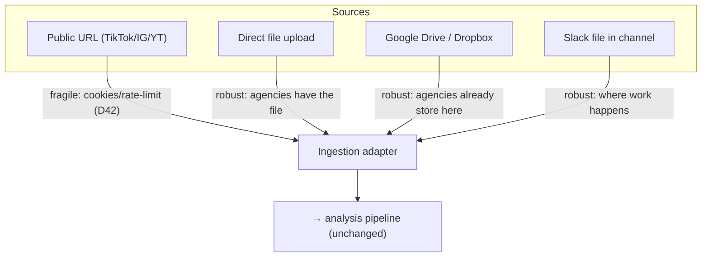

**Recommendation:** lead ingestion with **upload + Drive/Slack** (the agency *has the source file* —
they don't need us to scrape a public post). Keep url-scrape for **reference videos** (competitor
content you don't own) and accept it's best-effort there. This flips D42 from "blocker" to "only
affects the reference side, which degrades honestly anyway."

---

## 10. Improvement-over-time — where it lives, what it needs

This is the retention hook (and the only place a "score" earns its keep, despite D40's no-scoring
stance — D40 was about not building a scoring *service/UI prematurely*, not about never persisting a
number).

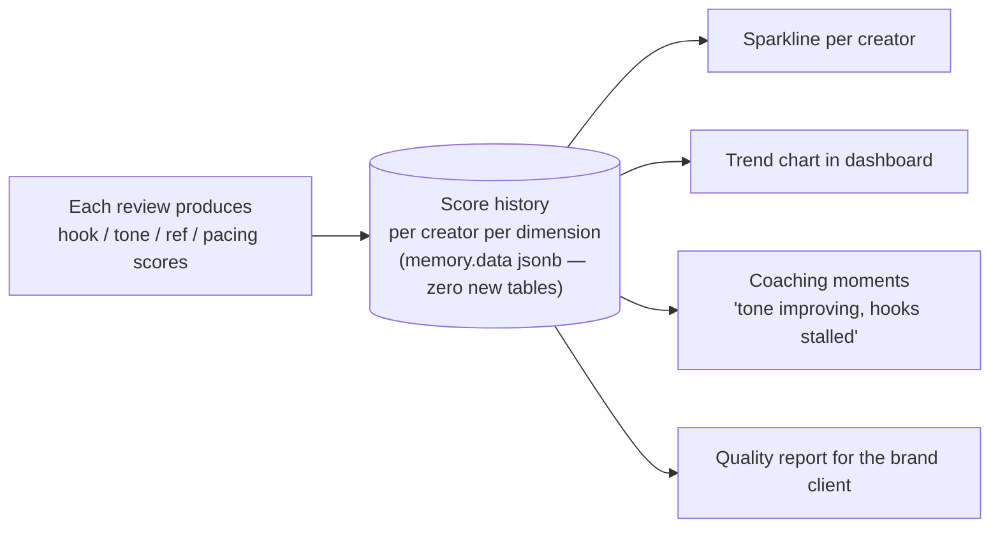

- **Data:** D40/D41 said no new tables — a per-creator score history can ride `memory.data` jsonb for
  the concept test, harden into a real table later. One row per dimension per review.
- **Surface:** belongs in the **table/dashboard (D)**, not the canvas. A canvas can't show "12
  creators × 4 dimensions × 8 weeks."
- **Watch-out:** scores must be *comparable across videos* to trend honestly. If the rubric drifts,
  the line is noise. This argues for a *stable scoring contract* even while the note stays
  agent-reasoned. (Open question §11.)

---

## 11. Open questions for feedback (mark these up)

1. **Surface order:** agree with C→E (note) → D (trends) → F (portal), canvas demoted to optional?
   Or keep canvas as the hero because it's built and demos well?
2. **Brief vs reference as ground truth:** ship v1 as *delivery-vs-reference* (leaner) and add the
   text-brief constraint layer later? Or is the text brief non-negotiable for agencies?
3. **One-sided vs two-sided:** design the data model for the creator portal *now* (so trends/identity
   are creator-anchored from day 1), even if we don't build the portal until Phase 3?
4. **Scoring honesty:** do we commit to a *stable scoring contract* (so trends are real) even though
   D40 keeps the note agent-reasoned? Where's the line between "agent reasons the note" and
   "deterministic-enough score to trend"?
5. **Ingestion:** lead with upload + Drive/Slack and treat url-scrape as reference-only best-effort?
6. **Note delivery:** is Slack the canonical output channel (generate anywhere, *land* in Slack)?
7. **Compute gating:** how do we surface "N analyses left / a few $ each" without it feeling stingy at
   the $199–500 tiers? (credits UI, or just a soft monthly cap per the 50/mo pricing?)
8. **Product boundary:** is agency-coaching a *mode* of the same Rainey app (shared canvas + agent),
   or a *separate product* with its own surface that just shares the analysis core? (My lean: shared
   core, separate primary surface.)
9. **What we throw away:** are we comfortable that the canvas review-frame work becomes "optional
   deep-dive" rather than the main event? (It's not wasted — it's the rich-diff client — but it stops
   being the home.)

---

## 12. Appendix — extra diagrams

### Delivery lifecycle (state)

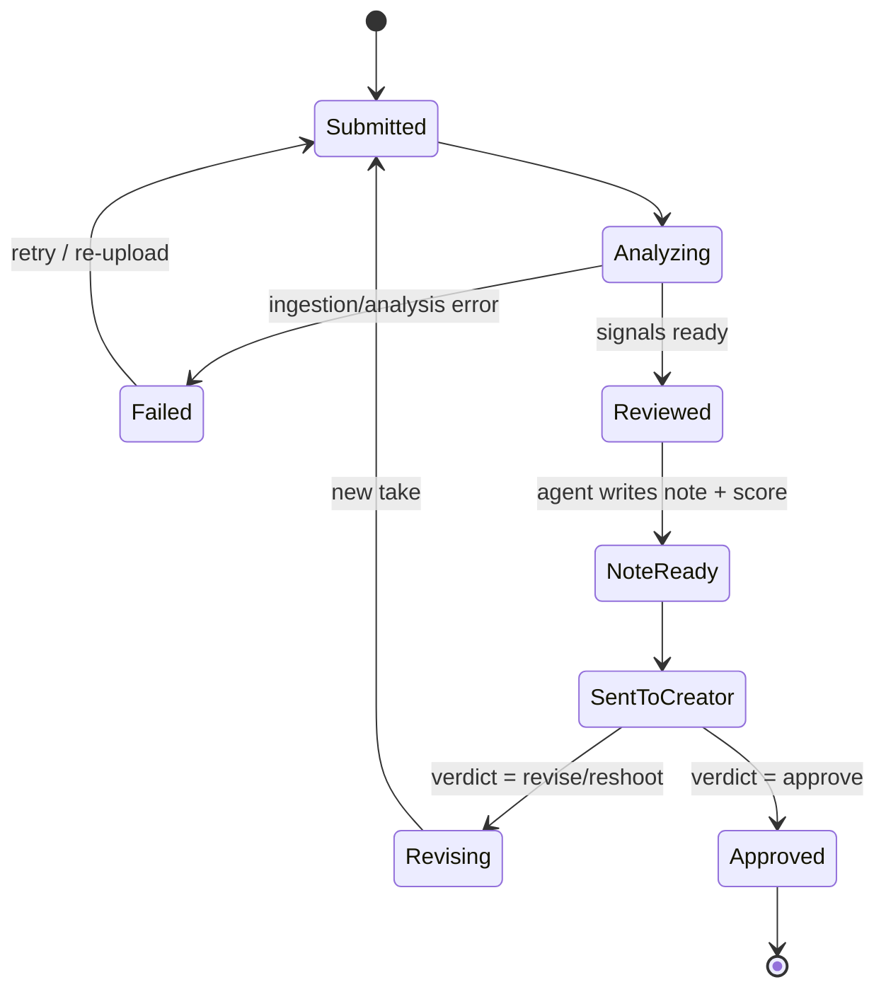

### Creator coaching journey (satisfaction over the loop)

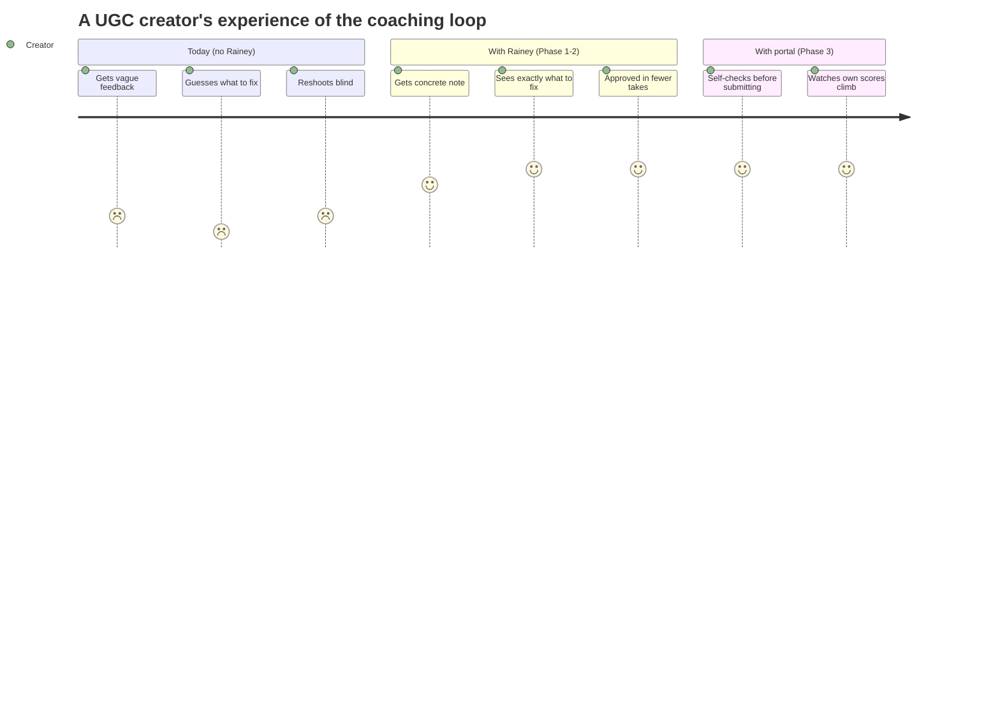

### Where the canvas actually fits (don't delete it — reposition it)

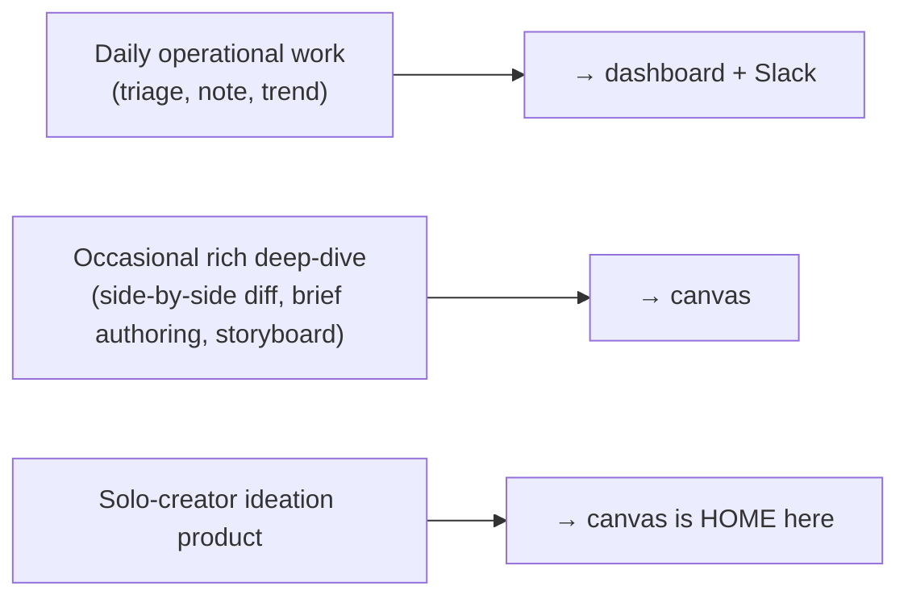

---

### Sources folded into this doc
- `rainey.lovable.app/agencies` (validated pitch) + `rainey.lovable.app` (creator product)
- Oliver / Vyral call transcript (pain, willingness-to-pay, Slack workflow, pricing, references)
- Codebase: `review_workflow.py`, `tools/review.py`, `analyze_llm.py`, `metrics_deterministic.py`,
  `schema.sql`, canvas components; decisions D39–D42; `docs/ugc-review-loop.md`;
  `docs/session-log-2026-06-26.md`
